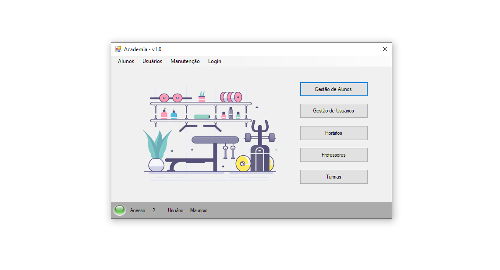
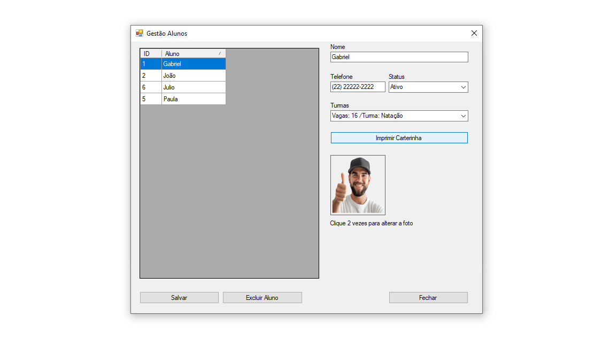
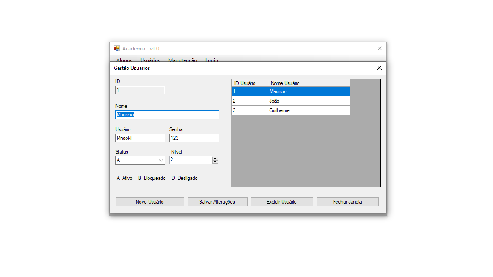
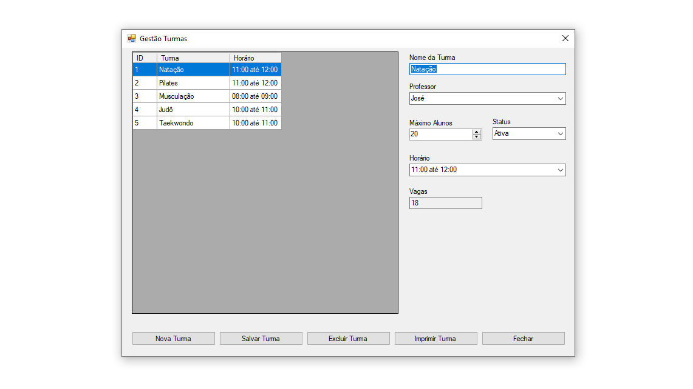
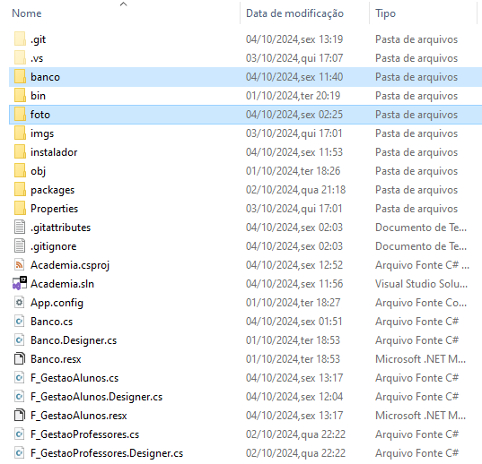
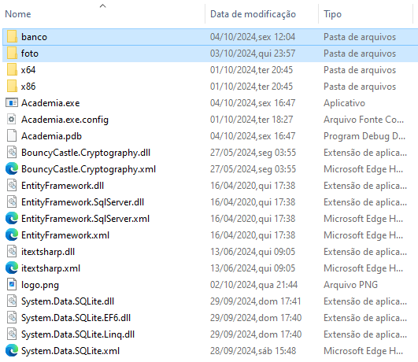

<div align="center"> <h1>Sistema de Academia</h1> </div>

<p align="center">Aplicação para gestão de academia, desenvolvida em C# com funcionalidades para gerenciar alunos, horários, turmas e mais.</p>

<p align="center">
  
  
  
</p>

## 📋 Funcionalidades Principais
Esta aplicação, desenvolvida em C# e .NET Framework, utiliza o SQLite para armazenar os dados e permite:

- **Gestão de alunos**: Cadastro, edição e exclusão de alunos da academia, com a opção de imprimir a carteirinha do aluno.
- **Gestão de usuários**: Controle de acessos e permissões para os administradores.
- **Listagem de horários**: Visualização dos horários disponíveis para as atividades, com a funcionalidade de imprimir os horários em formato PDF.
- **Listagem de professores**: Consulta e gerenciamento das informações dos professores, facilitando o acesso às suas qualificações e horários.
- **Listagem de turmas**: Gerenciamento de turmas, permitindo adicionar ou remover membros, além de visualizar as vagas disponíveis para cada turma.

## 🛠 Tecnologias utilizadas

- **C#** - Linguagem de programação usada para o desenvolvimento da aplicação
- **.NET Framework** - Framework utilizado para dar suporte ao desenvolvimento e execução da aplicação
- **Sqlite** - Banco de dados local leve para armazenar informações no dispositivo

## 📸 Screenshots

<p align="center">
  
</p>

<p align="center">
  
</p>

<p align="center">
  
</p>

<p align="center">
  
</p>

## 🌐 Download do Instalador do Projeto
Você pode baixar o instalador do projeto diretamente [aqui](https://github.com/mauricio071/Sistema-de-Academia/blob/master/instalador/Instalador_Academia/Instalador_sistema_academia.rar) e começar a utilizar o Sistema de Academia na sua máquina.

## 🖥️ Como configurar o projeto
Siga os passos abaixo para instalar e executar o projeto em seu ambiente local:

### 1. Clone o repositório:

```bash
$ git clone https://github.com/mauricio071/Sistema-de-Academia
```

### 2. Acesse o diretório do projeto:

```bash
$ cd Sistema-de-Academia
```
### 3. Organize as pastas do projeto:

Para garantir que o projeto funcione corretamente, é essencial mover as pastas "banco" e "foto" para o diretório apropriado dentro da estrutura do projeto. Siga as etapas abaixo:

#### 1. Localize as pastas "banco" e "foto" no diretório do projeto.

#### 2. Mova as pastas para o seguinte caminho:

```bash
Sistema de Academia\bin\Debug
```

#### 3. Verifique a estrutura do projeto após a movimentação das pastas.

#### Pasta de origem:



#### Pasta destino:



### 4. Abra o projeto em uma IDE compatível com C#:

- É Recomendado o uso do Visual Studio para abrir e compilar o projeto.

### 5. Compile e execute o projeto:

- Com o Visual Studio aberto, compile o projeto e depois disso, execute a aplicação.
